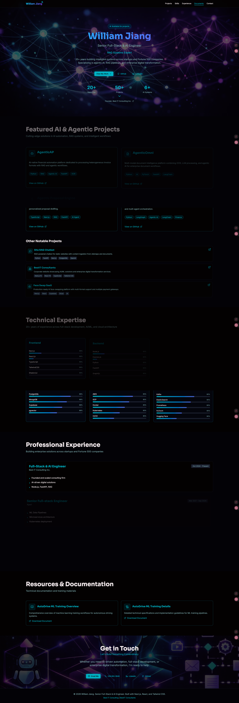

# William Jiang - Portfolio



A modern, tech-forward portfolio website showcasing my work as a Senior Full-Stack & AI Engineer. Built with cutting-edge technologies and featuring neural network-inspired design aesthetics.

🌐 **Live Site**: [williamjxj.github.io](https://williamjxj.github.io)

## ✨ Features

- **🎨 Neural Networks Design Theme** - Tech-forward minimalism with cyberpunk aesthetics
- **⚡ Animated Statistics** - Dynamic counting animations for experience metrics
- **🤖 Featured AI Projects** - Showcase of agentic AI, RAG systems, and ML workflows
- **📱 Fully Responsive** - Optimized for all devices from mobile to desktop
- **🎭 Smooth Animations** - Powered by Framer Motion and GSAP
- **🌙 Dark Mode Native** - Deep charcoal background with electric cyan and purple accents
- **⚡ Lightning Fast** - Built with Vite for optimal performance

## 🛠️ Tech Stack

### Frontend
- **Framework**: React 18 + TypeScript
- **Build Tool**: Vite
- **Styling**: Tailwind CSS + shadcn/ui components
- **Animations**: Framer Motion + GSAP
- **Routing**: Wouter (lightweight React router)

### Backend
- **Runtime**: Node.js
- **Framework**: Express.js
- **Build**: esbuild

### UI Components
- Radix UI primitives
- Custom shadcn/ui components
- Lucide React icons

## 🚀 Getting Started

### Prerequisites
- Node.js 18+ or compatible runtime
- pnpm (recommended) or npm

### Installation

```bash
# Clone the repository
git clone https://github.com/williamjxj/williamjxj.github.io.git
cd williamjxj.github.io

# Install dependencies
pnpm install
# or
npm install
```

### Development

```bash
# Start the development server
pnpm dev
# or
npm run dev
```

The app will be available at `http://localhost:5173`

### Build for Production

```bash
# Build both client and server
pnpm build
# or
npm run build
```

### Preview Production Build

```bash
# Preview the production build
pnpm preview
# or
npm run preview
```

## 📝 Available Scripts

| Script | Description |
|--------|-------------|
| `pnpm dev` | Start development server with hot reload |
| `pnpm build` | Build for production (client + server) |
| `pnpm start` | Start production server |
| `pnpm preview` | Preview production build locally |
| `pnpm check` | Type-check with TypeScript |
| `pnpm format` | Format code with Prettier |

## 📁 Project Structure

```
williamjxj.github.io/
├── client/                 # Frontend React application
│   ├── public/            # Static assets
│   │   ├── docs/          # Downloadable documents
│   │   ├── github-io.png  # Portfolio banner
│   │   └── favicon.svg    # Site favicon
│   └── src/
│       ├── components/    # React components
│       │   ├── ui/        # shadcn/ui components
│       │   └── ...        # Custom components
│       ├── contexts/      # React contexts (Theme, etc.)
│       ├── hooks/         # Custom React hooks
│       │   └── useCountUp.ts  # Animated counting hook
│       ├── lib/           # Utility functions
│       ├── pages/         # Page components
│       │   ├── Home.tsx   # Main landing page
│       │   └── NotFound.tsx
│       └── ...
├── server/                # Backend Express server
│   └── index.ts           # Server entry point
├── shared/                # Shared constants & utilities
└── ...
```

## 🎨 Design Philosophy

This portfolio follows the **"Neural Networks" design theme** - a tech-forward minimalism approach that combines:

- **Dark Mode Primary**: Deep charcoal backgrounds (#0a0e27)
- **Electric Accents**: Cyan (#00d9ff) and purple (#7c3aed) highlights
- **Geometric Precision**: Clean layouts with subtle neon effects
- **Interactive Elements**: Smooth animations and hover effects
- **Data Visualization**: Emphasis on technical credibility

## 🌟 Key Highlights

### Animated Statistics
Custom-built `useCountUp` hook that creates engaging number counting animations:
- Increments by 1 continuously until reaching target value
- Smooth viewport-triggered animations
- Fully responsive across all devices

### Featured Projects
- **AgenticAP** - AI-native financial automation with RAG
- **AgenticOmni** - Multi-modal document intelligence platform
- **Agentic Proposal Engine** - AI-powered proposal automation
- **Agentic LangGraph Accounting** - Intelligent accounting system
- And more...

### Professional Experience
20+ years across:
- Enterprise AI/ML solutions
- Full-stack development
- Cloud architecture (AWS, GCP)
- Microservices & DevOps

## 📄 License

MIT License - feel free to use this as inspiration for your own portfolio!

## 🤝 Connect

- **GitHub**: [@williamjxj](https://github.com/williamjxj)
- **LinkedIn**: [William Jiang](https://www.linkedin.com/in/william-jiang-226a7616/)
- **Website**: [Best IT Consulting](https://www.bestitconsulting.ca/)
- **Email**: Available on request

---

Built with ❤️ by William Jiang | Senior Full-Stack & AI Engineer
